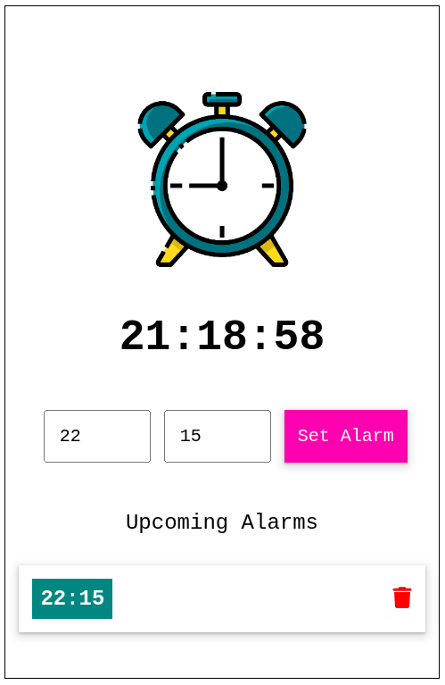

# Alarm [Responsive Alarm]

We can see the current time and set alarm at any time.
When current time hits alarm time, ringtone is played.

## What's inside?

- Set alarm using input field with hours and minutes.
- when current time hits alarm time ringtone plays.
- A pop up is shown to dismiss the current alarm.

## Screenshots

## Authors

- [@ujjawalbiswas](https://www.linkedin.com/in/ujjawal-biswas-b40611142/)

## License

[MIT](https://choosealicense.com/licenses/mit/)